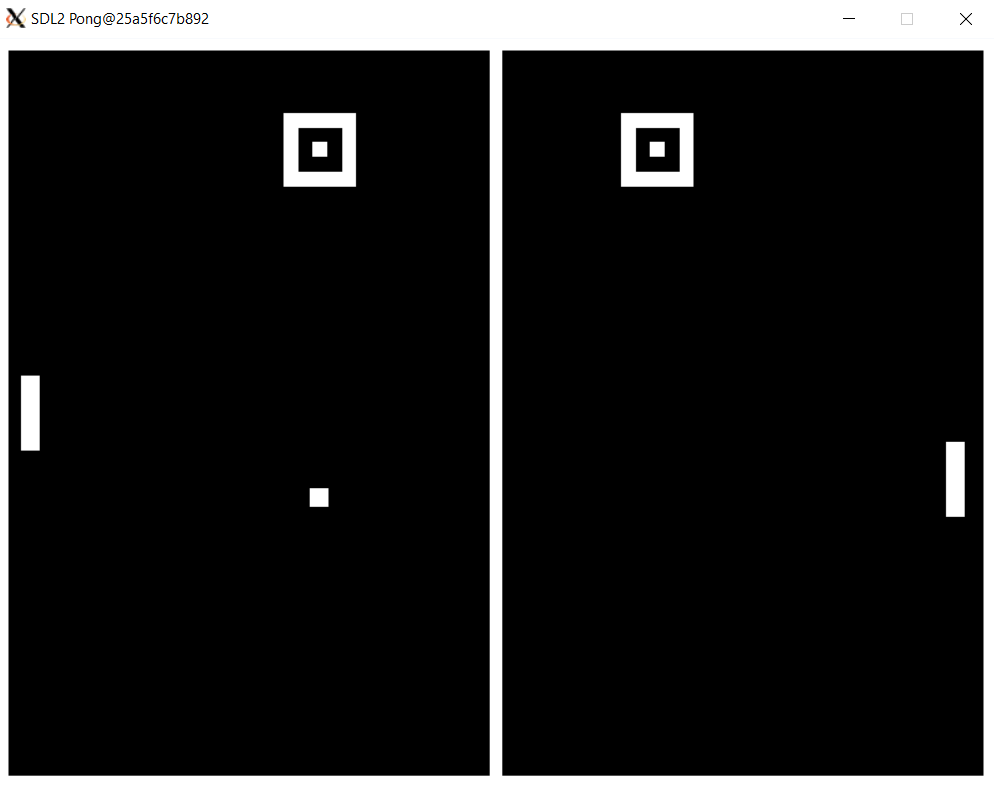

# SDL2 Pong
This is a simple implementation of the classic Pong game using C++ and SDL2.



## Dev Environment 
This project provides [VS Code Development Container](https://code.visualstudio.com/docs/remote/containers) configuration at `.devcontainer/`. Via this configuration, you automatically have a complete (Debian-based) development environment. 
Additionally, to run the UI out of the container, you need to use a X11 server. I will briefly explain how to run them in order to display the GUI from the container:

**Windows**<br>
I recommend  [VcXSrv](https://sourceforge.net/projects/vcxsrv/) if your host system is Windows, which I recommended for the Java-based CCM1 did not work here). Once you have it installed, start it via `xlaunch.exe` and enable the option `Disable access control` before you start the server. Now, you can start a GUI app in your container that will be displayed via the X-server on the host system.

For running audio from your development container, you need a [PulseAudio](https://www.freedesktop.org/wiki/Software/PulseAudio/) server on the host to forward sound from a Docker container to the host.

1. Download the PulseAudio server for Windows
   https://www.freedesktop.org/wiki/Software/PulseAudio/Ports/Windows/Support/

2. Unzip the download and make the following adjustment in the config file at `pulseaudio-1.1/etc/pulse/default.pa`:
   In section `### Network access`, uncomment the line `load-module module-native-protocol-tcp`, and extend it as follows:
   
    ```
    load-module module-native-protocol-tcp listen=0.0.0.0 auth-anonymous=1
    ```

   This configures the PulseAudio server to accept any incoming client.

3. Start the PulseAudio server by executing `pulseaudio-1.1/bin/pulseaudio.exe`
   Easiest way is to execute it from command line and displaying the pid file.
    ```
    pulseaudio-1.1/bin/pulseaudio.exe --use-pid-file=false
    ```